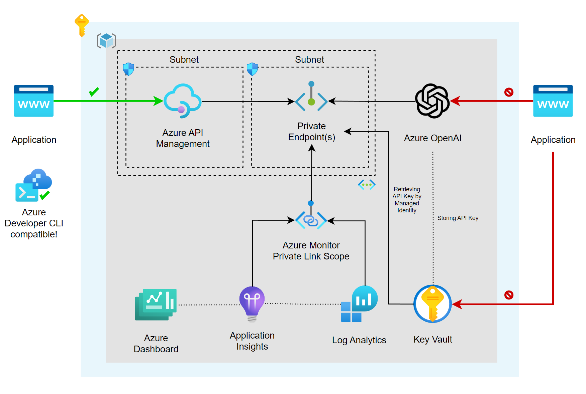

# Azure API Management with Azure OpenAI

## Architecture

### Azure API Management

[Azure API Management](https://azure.microsoft.com/en-us/services/api-management/) is a fully managed service that enables customers to publish, secure, transform, maintain, and monitor APIs. It is a great way to expose your APIs to the outside world in a secure and manageable way.

### Azure OpenAI

[Azure OpenAI](https://azure.microsoft.com/en-us/services/openai/) is a service that provides AI models that are trained on a large amount of data. You can use these models to generate text, images, and more.

### Managed identities

[Managed identities](https://learn.microsoft.com/en-us/azure/active-directory/managed-identities-azure-resources/overview) allows you to secure communication between services. This is done without having the need for you to manage any credentials.

### Virtual Network

[Azure Virtual Network](https://azure.microsoft.com/en-us/services/virtual-network/) allows you to create a private network in Azure. You can use this to secure communication between services.

### Azure Private DNS Zone

[Azure Private DNS Zone](https://docs.microsoft.com/en-us/azure/dns/private-dns-overview) allows you to create a private DNS zone in Azure. You can use this to resolve hostnames in your private network.

### Azure Key Vault

[Azure Key Vault](https://learn.microsoft.com/en-us/azure/key-vault/general/overview) allows you to store secrets securely. Your application can access these secrets securely through the use of managed identities.

### Application Insights

[Application Insights](https://azure.microsoft.com/en-us/services/monitor/) allows you to monitor your application. You can use this to monitor the performance of your application.

### Log Analytics

[Log Analytics](https://azure.microsoft.com/en-us/services/monitor/) allows you to collect and analyze telemetry data from your application. You can use this to monitor the performance of your application.

### Azure Monitor Private Link Scope

[Azure Monitor Private Link Scope](https://learn.microsoft.com/en-us/azure/azure-monitor/logs/private-link-security#configure-access-to-your-resources) allows you to define the boundaries of your monitoring network, and only allow traffic from within that network to your Log Analytics workspace. This is a great way to secure your monitoring network.

### Private Endpoint

[Azure Private Endpoint](https://docs.microsoft.com/en-us/azure/private-link/private-endpoint-overview) allows you to connect privately to a service powered by Azure Private Link. Private Endpoint uses a private IP address from your VNet, effectively bringing the service into your VNet.

## Manual Deployment

- [API Management vNet Integraion]https://learn.microsoft.com/en-us/azure/api-management/api-management-using-with-vnet?tabs=stv2

- [Azure Open AI Private Endpoints](https://techcommunity.microsoft.com/t5/azure-architecture-blog/azure-openai-private-endpoints-connecting-across-vnet-s/ba-p/3913325)

- [Azure Monitor Private Link Scope](https://learn.microsoft.com/en-us/azure/azure-monitor/logs/private-link-security#configure-access-to-your-resources)

## Bicep Deployment

- https://learn.microsoft.com/en-us/azure/azure-resource-manager/bicep/deploy-vscode